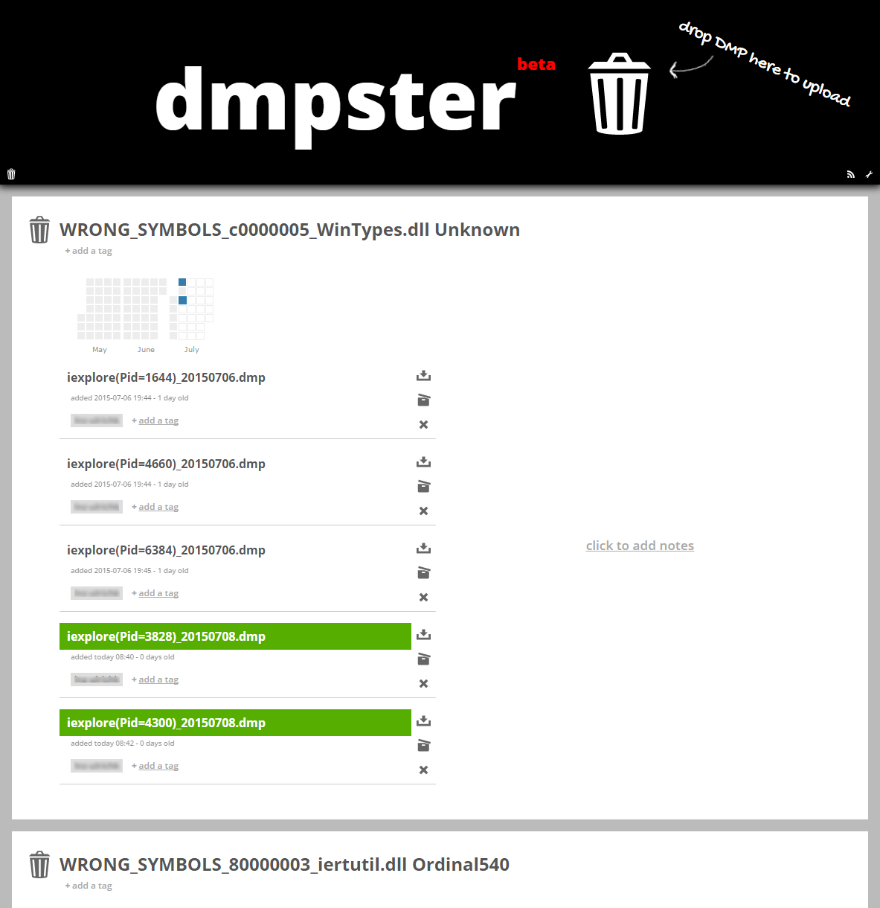

#dmpster#

_dmpster_ is a simple web app for storing `.dmp`-files. 
It also does an automated analysis of the `.dmp`-file (`!analyze - v`) to give you a quick overview what happend.

#Features#
* Easy file upload via drag and drop.
* Automated analysis of uploaded `.dmp`-files.
* Automatically loads .NET access DLL in the correct version.
* Detects if it needs to use 32- or 64-bit version, depending on the `.dmp`-file.
* Organize your `.dmp`-files by tagging them.
* Permanent links to share via e-mail or instant messaging.
* File upload can be automated.

#Installation#
* Install Java
* Install Debugging Tools for Windows
* Install [play framework](http://downloads.typesafe.com/play/2.2.0/play-2.2.0.zip)
* Check out the dmpster source in a local directory
* adapt `conf/application.conf` and `conf/prod.conf` if necessary.
* When running the first time, start `run-apply-evolution.cmd`, later you can start it with `run.cmd`.
* Done!
